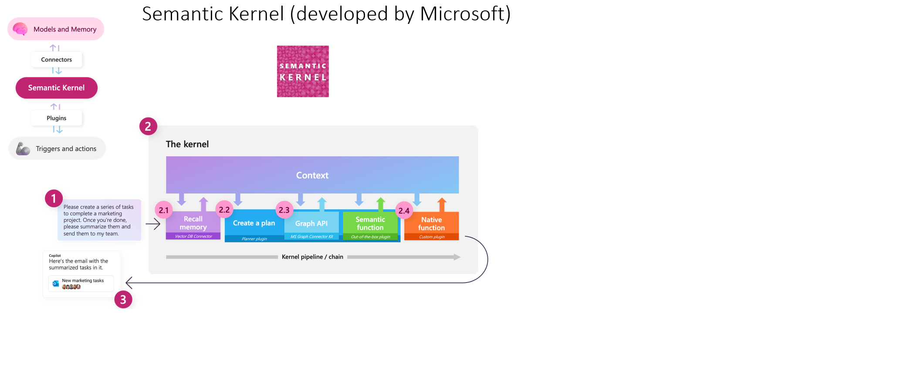

# Semantic Kernel Workshop (PoC)

This repository provides Proof of Concept (PoC) examples using Microsoft's [Semantic Kernel](https://github.com/microsoft/semantic-kernel). It includes various connectors, plugins, and planners to demonstrate how to build intelligent systems with advanced memory and reasoning capabilities.



## Features

- **Connectors**: Includes Bing Search, Outlook, and OpenAI connectors.
- **Plugins**: Demonstrates prompt engineering and type-safe plugin creation.
- **Planners**: Sequential and research planners integrated with Semantic Kernel.
- **Memory Utilities**: Examples of memory manipulation using Semantic Kernel's built-in features.

## Getting Started

### Prerequisites

- .NET 6 or later
- Azure OpenAI service (optional for certain examples)

### Installation

1. Clone the repository:
    ```bash
    git clone https://github.com/cyberkoolman/sk.workshop.git
    cd sk.workshop
    ```

2. Install dependencies to each project in respective directory:
    ```bash
    dotnet restore
    ```

### Usage

1. Open the solution in Visual Studio or your preferred IDE.
2. Choose a project or example to run, and follow the instructions in the comments or documentation.
3. Modify and extend the examples to fit your use case.
